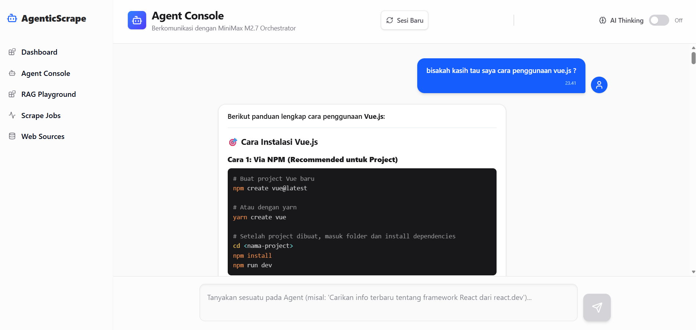
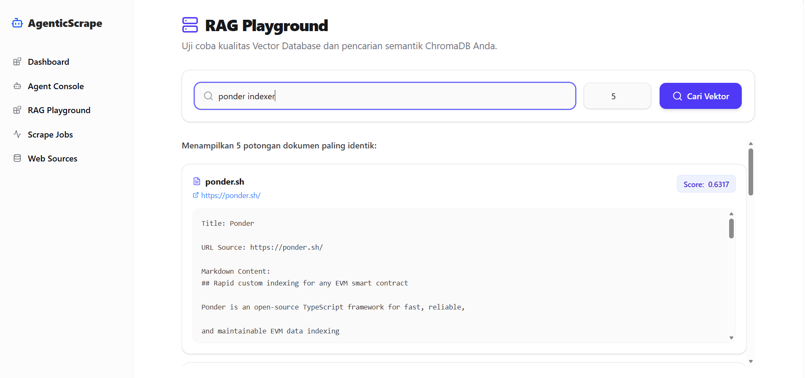
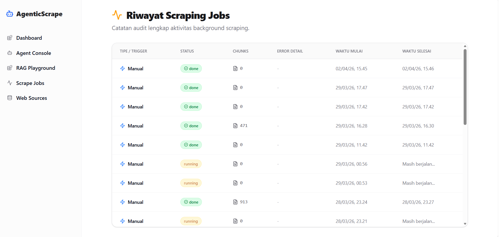
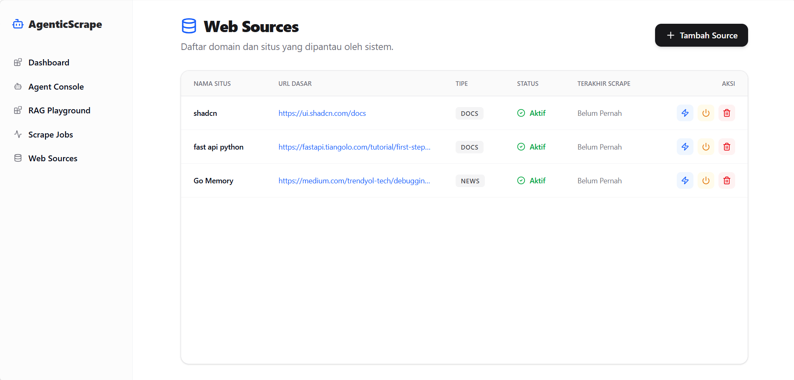

# 🤖 Agentic Scraper

> LLM-orchestrated web scraping dan knowledge retrieval system dengan MiniMax M2.7 dan ReAct agent loop.

[](https://fastapi.tiangolo.com/)
[](https://react.dev/)
[](https://www.trychroma.com/)
[](https://www.postgresql.org/)
[](https://platform.minimax.chat/)

---

## 🎯 Overview

Sistem agen AI yang mampu:
- 🧠 Berpikir secara mandiri (ReAct: Reason → Act → Observe)
- 🔍 Mencari informasi real-time via DuckDuckGo
- 🕷️ Merayapi website dokumentasi secara otomatis
- 📚 Menyimpan ke Vector DB untuk RAG
- 💬 Menawab pertanyaan berdasarkan knowledge lokal

**Priority Flow:**
```
Cek Memory (RAG) → Internet Search → Scrape → Store → Answer
```

---

## 💰 Cost Efficiency

Sistem ini memberikan **penghematan hingga 90%** dibanding upload dokumen langsung ke ChatGPT/Claude.

```
┌─────────────────────────────────────────────────────────────────────────┐
│  COST COMPARISON - 1000 pages scraping                                  │
├──────────────────────────┬──────────────┬───────────────────────────────┤
│ Approach                 │ Input Tokens │ Est. Cost (GPT-4o mini)       │
├──────────────────────────┼──────────────┼───────────────────────────────┤
│ Upload 500 PDFs          │ 5,000,000    │ ~$15.00                      │
│ ke ChatGPT (naive)       │              │                              │
├──────────────────────────┼──────────────┼───────────────────────────────┤
│ Agentic Scraper          │   500,000    │  ~$1.50                      │
│ (RAG + selective chunks) │  (-90%)      │  (90% savings)               │
└──────────────────────────┴──────────────┴───────────────────────────────┘
```

**Mengapa Lebih Murah?**
1. **RAG + ChromaDB** — Scraping sekali, query pakai similarity search `top_k=5`
2. **Text Cleaning** — Hapus HTML/CSS/navigasi sebelum ke LLM
3. **Prompt Caching** — System prompt statis dapat di-cache oleh provider
4. **Local Assets** — PostgreSQL/ChromaDB lokal = bebas paywall SaaS

---

## ✨ Key Features

| Feature | Description |
|---|---|
| 🧠 **ReAct Agent** | Multi-step reasoning dengan 5 iterasi per sesi |
| 🎯 **RAG-First** | Selalu cek Vector DB sebelum web search |
| 🧮 **AI Thinking** | Toggle reasoning mode (1K tokens budget) |
| 📐 **LaTeX Math** | KaTeX rendering untuk rumus matematika |
| 🎨 **Code Highlight** | Prism.js dengan Tomorrow Dark theme |
| 🔄 **Auto-Capture** | Scraped content otomatis tersimpan |
| 🕸️ **Dual Scraper** | Playwright (primary) + Jina.ai (fallback) |

---

## 🚀 Quick Start

### Prerequisites
- Python 3.11+ | Node.js 20+
- PostgreSQL (running instance)
- MiniMax API Key & Group ID

### 1. Backend
```bash
cd backend
pip install -r requirements.txt
playwright install chromium
cp .env.example .env  # edit with your keys
python main.py        # runs at 127.0.0.1:8000
```

### 2. Frontend
```bash
cd frontend
npm install
npm run dev           # runs at localhost:5173
```

> ⚠️ **Windows**: Selalu pakai `python main.py`, BUKAN `uvicorn --reload` (asyncio conflict).

---

## 🛠️ Tech Stack

| Component | Technology |
|---|---|
| API Framework | FastAPI + Uvicorn |
| LLM Agent | MiniMax M2.7 |
| Scraper | Playwright (Crawl4AI) + Jina.ai |
| Vector DB | ChromaDB |
| Relational DB | PostgreSQL |
| Embedding | MiniMax Text Embedding |
| Search | DuckDuckGo (`ddgs`) |
| Frontend | React 19 + Vite + TypeScript + Tailwind |

---

## 📸 Screenshots

| Agent Console | RAG Playground |
|---|---|
|  |  |

| Scrape Page | Image |
|---|---|
|  |  |

---

## 📁 Project Structure

```
agentic-scraper/
├── backend/
│   ├── agent/         # ReAct agent (brain, memory, tools)
│   ├── api/           # REST endpoints
│   ├── db/            # PostgreSQL + ChromaDB
│   ├── pipeline/     # Cleaner → Chunker → Embedder
│   ├── scrapers/      # Playwright + Jina.ai
│   └── main.py        # FastAPI entrypoint
├── frontend/          # React + Vite + TypeScript
├── docs/              # Detailed documentation
│   ├── api.md
│   ├── architecture.md
│   └── roadmap.md
└── image/             # Screenshots
```

---

## 📚 Documentation

- [API Reference](docs/api.md)
- [Architecture](docs/architecture.md)
- [Roadmap](docs/roadmap.md)

---

## 🤝 Contributing

Pull requests welcome! Format commit: `feat(scope): description`

---

## 📄 License

MIT License
